<!-- omit in toc -->
# PWM test application for Nuvoton N76E003 SDCC BSP

- [Nuvoton N76E003 development board](#nuvoton-n76e003-development-board)
- [Supported commands:](#supported-commands)
	- [\> div](#-div)
	- [\> period](#-period)
	- [\> type](#-type)
	- [\> pwm](#-pwm)
	- [\> duty](#-duty)
	- [\> mask](#-mask)
	- [\> polarity](#-polarity)
	- [\> gpmode](#-gpmode)
	- [\> inttype](#-inttype)
	- [\> opmode](#-opmode)
	- [\> phases](#-phases)
	- [\> shift](#-shift)


# Nuvoton N76E003 development board
There are a few different Nuvoton N76E003 development boards available online. This one was used for the test app:

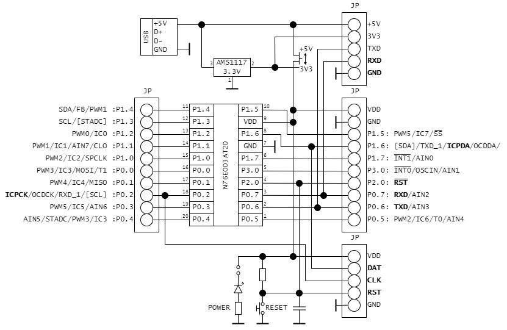

```
             N76E0003 dev board pinout:
                G R C D V  + 3 T R G
                N S L A D  5 V X X N
                D T K T D  V 3 0 0 D
                | | | | |  | | | | |
                +----------------------+
             ---|11 P1.4         VDD 9 |--- VDD
             ---|12 P1.3         GND 7 |--- GND
        PWM0 ---|13 P1.2        P1.5 10|---
        PWM1 ---|14 P1.1        P1.6 8 |--- DAT [ICP]
        PWM2 ---|15 P1.0        P1.7 7 |---
             ---|16 P0.0        P3.0 5 |---
             ---|17 P0.1        P2.0 2 |--- RST [ICP]
   [ICP] CLK ---|18 P0.2        P0.7 3 |--- UART0 RX
             ---|19 P0.3        P0.6 2 |--- UART0 TX
        MARK ---|20 P0.4        P0.5 1 |---
                +----------------------+

```

# Supported commands:
```
> help
VER: 2103.28 (6016 bytes)
CMD:
    reset
    div [1|2|4|8|16|32|64|128]
    period [$u16]
    type [edge|center]
    pwm [start|stop]
    duty $0-5 [$u16]
    mask $0-5 [pwm|low|high]
    gpmode [enable|disable]
    inttype [fall|rise|center|end|period]
    opmode [independent|complementary|synchronized|phased]
    phases [$start $end]
    shift [0-255]
```

Used code and data:
```
   Name              Start    End  Size   Max Spare
   ---------------- ------ ------ ----- ----- -----------
   REG BANKS        0x0000 0x000F     2     4     2
   IDATA            0x0000 0x0055    86   256   170
   OVERLAYS                           2
   STACK            0x0056 0x00FF   170   248   170
   EXTERNAL RAM     0x0001 0x00c7   199   768   569 74.1% free
   ROM/EPROM/FLASH  0x0000 0x182c  6189 18432 12243 66.4% free
```

## > div
Sets Fsys divider, one of the following: 1, 2, 4, 8, 16, 32, 64, 128

## > period
Sets PWM counter period, 16 bits value.

## > type
Sets PWM generation type: edge or center.

For example, with the same period value, changing type from ``edge`` to ``center``:

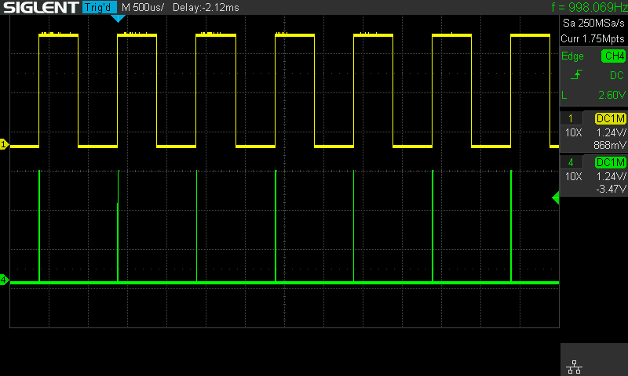

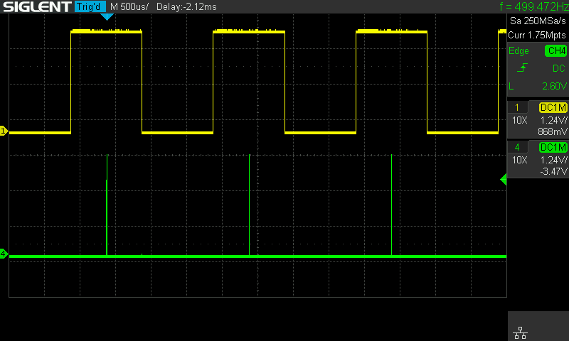

Yellow: PWM channel 0.

Green: interrupt type ``end``.

## > pwm
Start/stop PWM generator, or prints all current parameter:
```
> pwm
running div:16 period:999 type:center opmode:phased inttype:period group:disabled
channel 0   250 high
channel 1   500 low
channel 2   750 high
channel 3     0 low
channel 4     0 low
channel 5     0 low

```

## > duty
Sets duty counter for a channel.

## > mask
Sets channel's mode mask:
* pwm
* low
* high

## > polarity
Sets PWM signal polarity for the given channel:
* positive
* negative

## > gpmode
Enables/disabled group mode.

## > inttype
Selects interrupt type:
* rise - rising edge of the channel 0 for ``edge`` PWM type.
* fall - falling edge of the channel 0 for ``edge`` PWM type.
* end - endpoint of the ``center`` period type.
* center - center point of the ``center`` period type.
* period - SW defined type, interrupt toggles between ``center`` and ``end`` types. Works for both ``edge`` and ``center`` PWM types.

Rise interrupt:


Fall interrupt:


Period interrupt for ``edge`` type:

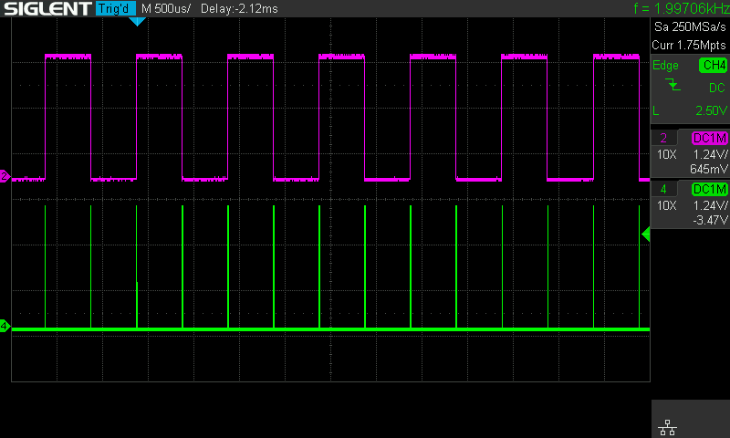

End interrupt:

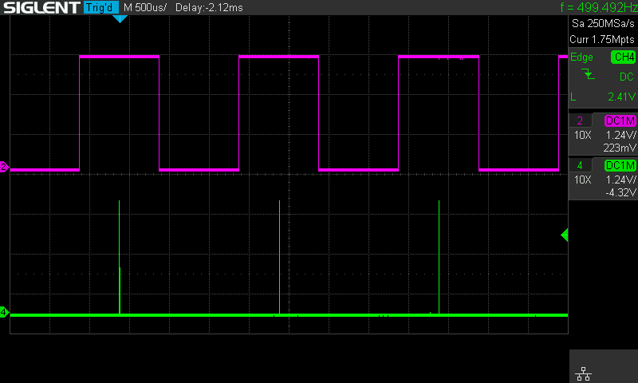

Center interrupt:

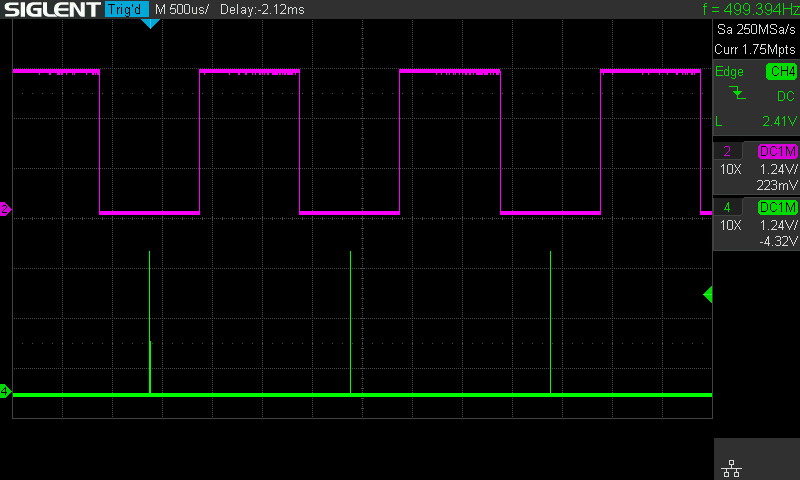


Period interrupt for ``center`` type:

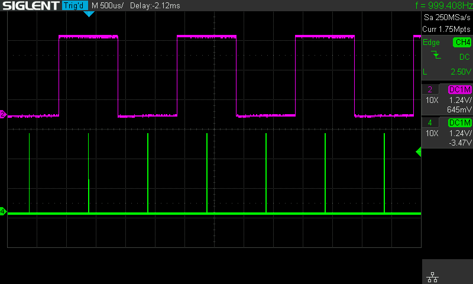

## > opmode
Select PWM operation mode:

* independent: all channels configured independent of each other
* complementary: PWM channels 0/2/4 are independent, but channels 1/3/5 are out-phase of 0/2/4
* synchronized: PWM channels 0/2/4 are independent, but channels 1/3/5 are in-phase of 0/2/4
* phased

## > phases
Selects PWM channels for phased output. This SW defined, interrupt driven mode. In this mode interrupt type will be set to ``period`` and PWM outputs will be masked from low to high in rotation with ``shift`` empty periods inserted. See examples below for the ``shift`` command.

In case if ``shift`` is set to 0, channels will switch with some dead time in between:

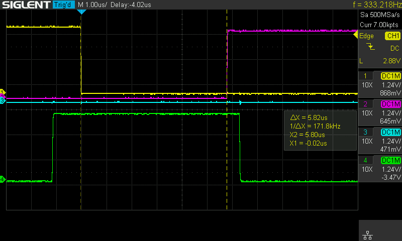

## > shift
Sets shift between channels in the phased mode in number of periods.

For example, if channels 0, 1 and 2 are in phased mode:

```> shift 0```

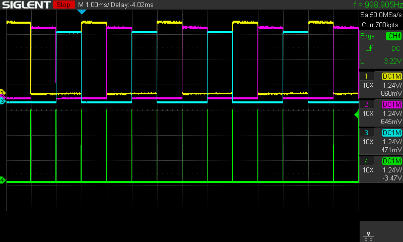

```> shift 1```

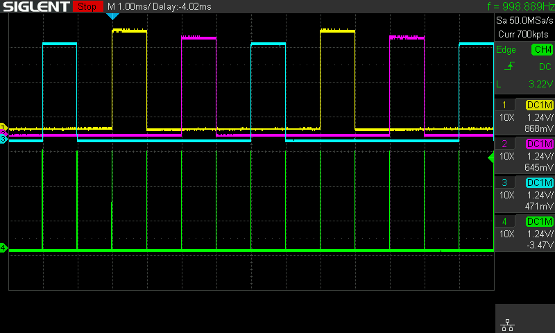

```> shift 2```

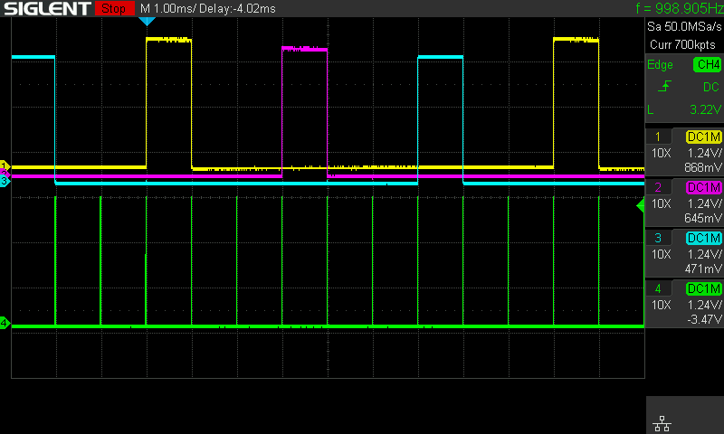