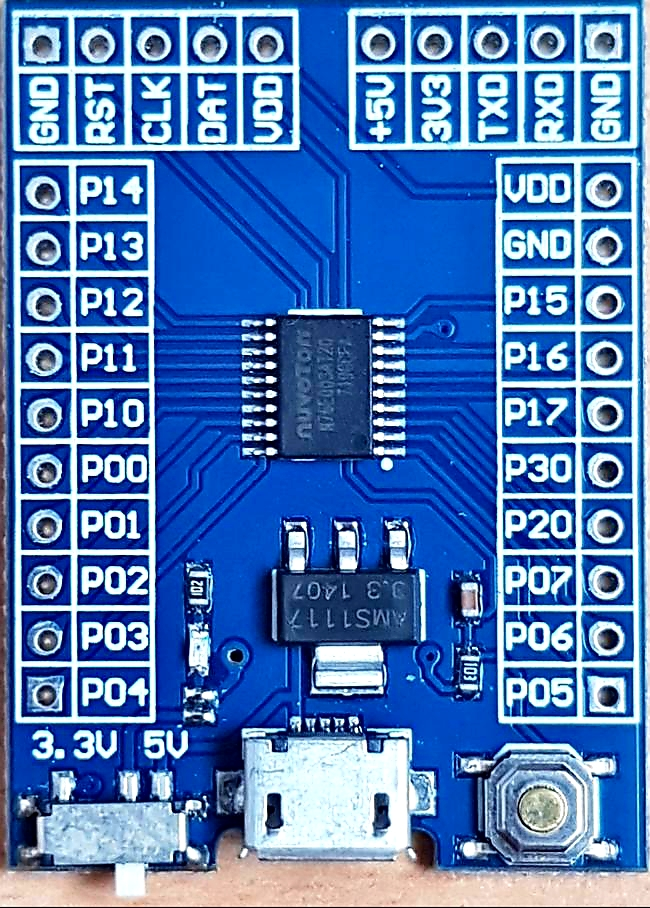
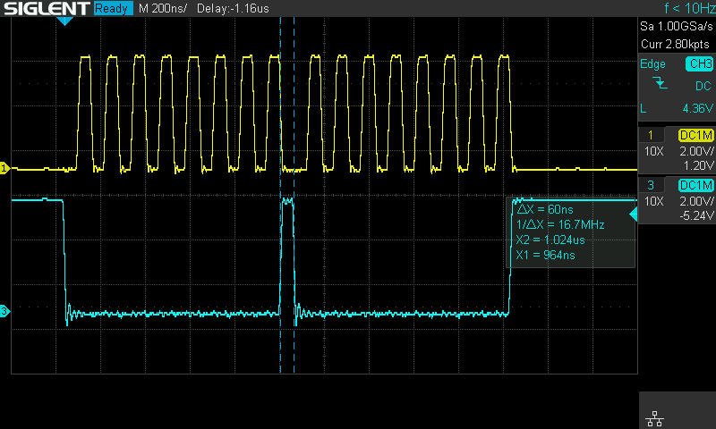
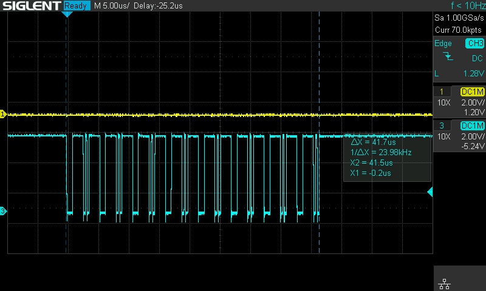
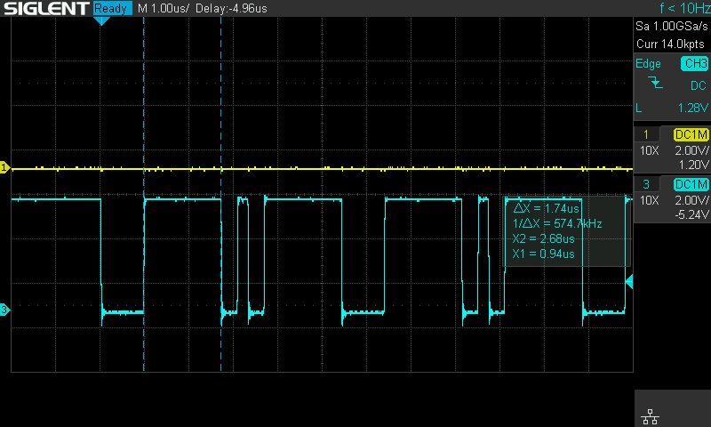
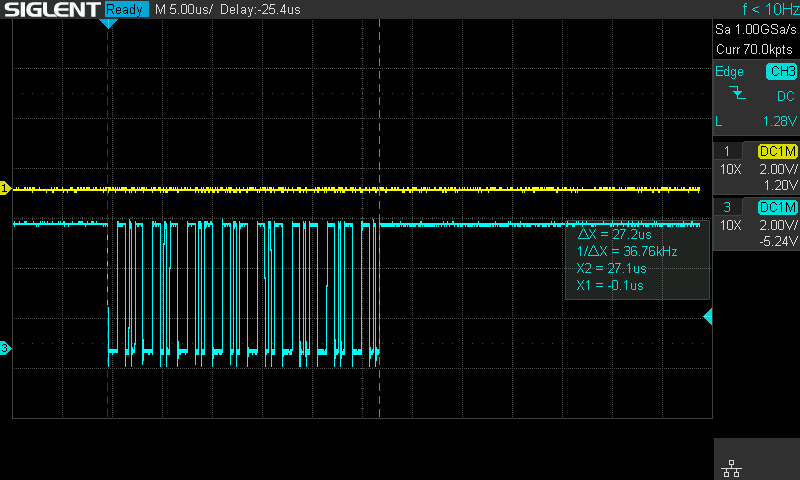
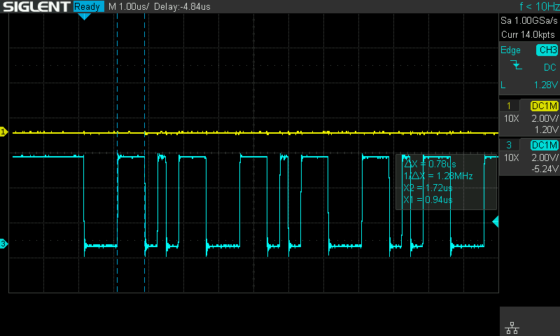

<!-- omit in toc -->
# Testing Nuvoton N76E003 SPI

- [Nuvoton N76E003 development board](#nuvoton-n76e003-development-board)
- [Supported commands:](#supported-commands)
	- [spi speed](#spi-speed)
	- [spi cpha](#spi-cpha)
	- [spi spis](#spi-spis)
	- [spi write](#spi-write)
	- [spi send](#spi-send)
- [Used code and data](#used-code-and-data)

# Nuvoton N76E003 development board
There are a few different Nuvoton N76E003 development boards available online. This one was used for the test app:



```
               N76E0003 dev board pinout:
                G R C D V    + 3 T R G
                N S L A D    5 V X X N
                D T K T D    V 3 0 0 D
                | | | | |    | | | | |
               +----------------------+
            ---|11 P1.4         VDD 9 |--- VDD
            ---|12 P1.3         GND 7 |--- GND
            ---|13 P1.2        P1.5 10|--- SS
            ---|14 P1.1        P1.6 8 |--- DAT [ICP]
      SPCLK ---|15 P1.0        P1.7 7 |---
       MOSI ---|16 P0.0        P3.0 5 |---
       MISO ---|17 P0.1        P2.0 2 |--- RST [ICP]
  [ICP] CLK ---|18 P0.2        P0.7 3 |--- UART0 RX
            ---|19 P0.3        P0.6 2 |--- UART0 TX
       MARK ---|20 P0.4        P0.5 1 |---
               +----------------------+
```

This example configures HW SPI for transmit only in Master mode.

Default configuration:
* MSB first
* SPCLK polarity is low in idle mode
* SS as general I/O and not used for slave select
* SPI clock phase select is 0, so data is sampled on the first edge of the clock signal

# Supported commands:
```
> help
VER: 2105.02 (3681 bytes)
CMD:
    reset
    spi speed 1|2|4|8
    spi cpha [0|1]
    spi spis [0-3]
    spi write $val
    spi send
```

## spi speed
Sets SPI clock speed in MHz. Valid values 1, 2, 4 or 8.

## spi cpha
Sets or reads SPI clock phase select bit. Valid values 0 or 1.

## spi spis
Sets or reads SPCR2 (Serial Peripheral Control Register 2) to get SPI Interval Selection between adjacent bytes. Valid values 0 to 3.

SPI Interval selection between adjacent bytes value depends on SPCR_CPHA bit and for 8MHz SPI clock:

| CPHA | SPIS1 | SPIS0 | Interval  | For 8MHZ  |
| ---- | ----- | ----- | --------- | --------- |
|  0   |   0   |   0   | 0.5 clock |  ~60 nsec |
|  0   |   0   |   1   | 1.0 clock | ~120 nsec |
|  0   |   1   |   0   | 2.0 clock | ~240 nsec |
|  0   |   1   |   1   | 2.0 clock | ~240 nsec |
|  1   |   0   |   0   | 0.5 clock |  ~60 nsec |
|  1   |   0   |   1   | 1.0 clock | ~120 nsec |
|  1   |   1   |   0   | 1.5 clock | ~180 nsec |
|  1   |   1   |   1   | 2.0 clock | ~240 nsec |

With the default settings this is how sending of two sequential 0 looks like (yellow: clock, blue: MOSI):



**Note:** N76E003 Datasheet v1.09 provides different data for Interval values:

| CPHA | SPIS1 | SPIS0 | Interval  |
| ---- | ----- | ----- | --------- |
|  0   |   0   |   0   | 0.5 clock |
|  0   |   0   |   1   | 1.0 clock |
|  0   |   1   |   0   | 1.5 clock |
|  0   |   1   |   1   | 2.0 clock |
|  1   |   0   |   0   | 1.0 clock |
|  1   |   0   |   1   | 1.5 clock |
|  1   |   1   |   0   | 2.0 clock |
|  1   |   1   |   1   | 2.5 clock |

but, as I can see, these intervals are true only for SPI clocks 1, 2 or 4 MHz.

## spi write
Sends provided 16bit value (MSB first) to the SPI bus.

## spi send
Sends hardcoded 16 bytes sequence ``0x00 0x18 0x00 0x18...`` to the SPI bus. This sequence is used to test the difference between ``SPSR::SPIF`` and ``SPSR::TXBUF`` flags.

Datasheet says very little about ``SPSR::TXBUF``, but it looks like this flag can be used successfully to detect when the next byte can be written to ``SPDR``, and ``SPSR::TXBUF`` works better for sending string of data.

Using ``SPSR::SPIF`` takes ~42 usec to send 16 bytes:



with inter-byte gap ~1.74 usec:



But using ``SPSR::TXBUF`` takes only ~27 usec to send 16 bytes:



with inter-byte gap ~0.78 usec:



# Used code and data
```
   Name              Start    End  Size   Max Spare
   ---------------- ------ ------ ----- ----- -----------
   REG BANKS        0x0000 0x000F     2     4     2
   IDATA            0x0000 0x0063   100   256   156
   OVERLAYS                           2
   STACK            0x0064 0x00FF   156   248   156
   EXTERNAL RAM     0x0001 0x00c7   199   768   569 74.1% free
   ROM/EPROM/FLASH  0x0000 0x0e60  3681 18432 14751 80.0% free
```

