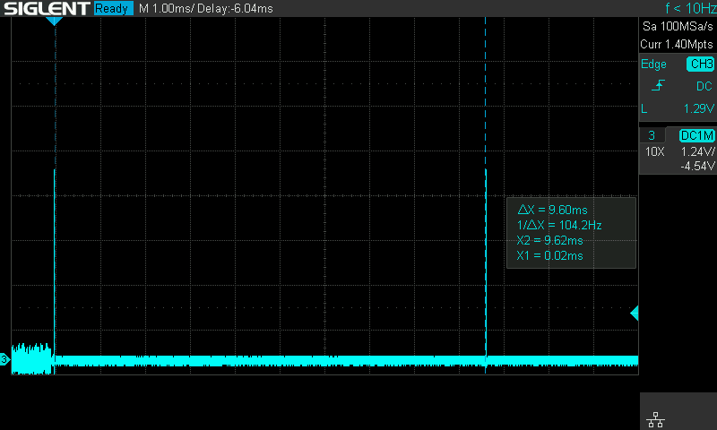
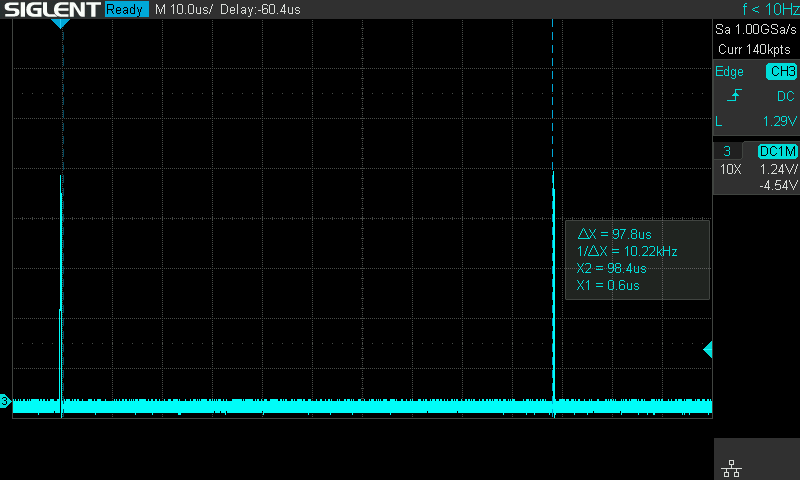
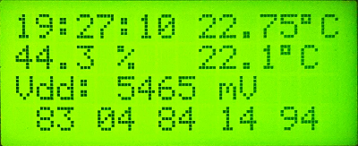

<!-- omit in toc -->
# Test application for Nuvoton N76E003 SDCC BSP

- [Used components](#used-components)
	- [Nuvoton N76E003 development board](#nuvoton-n76e003-development-board)
- [Supported commands:](#supported-commands)
	- [imem](#imem)
	- [cmem](#cmem)
	- [sfr](#sfr)
	- [reset](#reset)
	- [delay](#delay)
	- [rctrim](#rctrim)
	- [i2c](#i2c)
	- [i2cmem](#i2cmem)
	- [dht](#dht)
	- [kbd](#kbd)
	- [timer](#timer)
	- [bv](#bv)
	- [pcf](#pcf)
	- [rtc](#rtc)

# Used components

* Nuvoton N76E003 development board
* DHT22 (AM2302) humidity/temperature sensor
* RTC [DS3231](https://www.maximintegrated.com/en/products/analog/real-time-clocks/DS3231.html) with I2C EEPROM Atmel [24C32](https://ww1.microchip.com/downloads/en/DeviceDoc/doc0336.pdf) on board
* 20x4 LCD with [BV4618](http://www.byvac.com/index.php/BV4618) as I2C controller
* 16x4 LCD with [PCF8574](https://www.ti.com/lit/ds/symlink/pcf8574.pdf) as I2C controller
* PS/2 Mini Keyboard UK Layout

## Nuvoton N76E003 development board
There are a few different Nuvoton N76E003 development boards available online. This one was used for the test app:


```
             N76E0003 dev board pinout:
                G R C D V  + 3 T R G
                N S L A D  5 V X X N
                D T C T D  V 3 0 0 D
                | | | | |  | | | | |                                N76E0003 MCU pinout
                +------------------+                                +------------------+
        SDA  ---| P1.4         VDD |--- VDD                      ---| 1 P0.5    P0.4 20|--- PS/2 CLOCK
        SCL  ---| P1.3         GND |--- GND             UART0 TX ---| 2 P0.6    P0.3 19|--- PS/2 DATA
        WCT  ---| P1.2        P1.5 |--- EPOLL           UART0 RX ---| 3 P0.7    P0.2 18|--- ICPCLK [SCL]
        CLO  ---| P1.1        P1.6 |--- ICPDA [SDA]          RST ---| 4 P2.0    P0.1 17|---
        MARK ---| P1.0        P1.7 |---                          ---| 5 P3.0    P0.0 16|---
             ---| P0.0        P3.0 |---                          ---| 6 P1.7    P1.0 15|--- MARK
             ---| P0.1        P2.0 |--- RST                  GND ---| 7         P1.1 14|--- CLO
[SCL] ICPCLK ---| P0.2        P0.7 |--- UART0 RX     [SDA] ICPDA ---| 8 P1.6    P1.2 13|--- WKT signal
   PS/2 DATA ---| P0.3        P0.6 |--- UART0 TX             VDD ---| 9         P1.3 12|--- SCL
  PS/2 CLOCK ---| P0.4        P0.5 |--- DHT                EPOLL ---|10 P1.5    P1.4 11|--- SDA
                +------------------+                                +------------------+
```

# Supported commands:
```
> help
VER: 2104.04 (15563 bytes)
CID: DA
DID: 5036
CFG: FF FF FF FF FF
BGP: 0690 1260 mV
Vdd: 3605 mV
UID: 12-15-26-00-83-41-33-03-45-99-00-00
CMD:
    imem
    cmem [$addr [$len]]
    sfr [$addr]
    reset
    delay $val [mks]
    rctrim save
    rctrim [$trim]
    i2c scan|stop
    i2c wr $addr $val [$val ...]
    i2cmem erase [$fill]
    i2cmem read $addr
    i2cmem write $addr $val
    i2cmem dump [$addr] [$len]
    dht
    kbd $cmd [$arg]
    timer on|off
    timer lcd|uart on|off
    bv cls
    bv clr
    bv init
    bv reset
    bv led on|off
    bv goto 1-4 [1-20]
    pcf cls
    pcf init
    pcf led on|off
    pcf cursor on|off
    pcf goto $line [$pos]
    rtc init
    rtc dump
    rtc time [hh:mm:ss]
    rtc temp
    rtc 32k on|off
    rtc sqw on|off|1hz|1k|4k|8k
```

Even with so many commands there is still some resources available:
```
   Name              Start    End  Size   Max Spare
   ---------------- ------ ------ ----- ----- -----------
   REG BANKS        0x0000 0x000F     2     4     2
   IDATA            0x0000 0x008B   140   256   116
   OVERLAYS                           3
   STACK            0x008C 0x00FF   116   248   116
   EXTERNAL RAM     0x0001 0x00ec   236   768   532 69.3% free
   ROM/EPROM/FLASH  0x0000 0x3d24 15653 18432  2779 15.1% free
```

## imem
Dumps data memory:
```
> imem
     | 00 01 02 03 04 05 06 07 08 09 0A 0B 0C 0D 0E 0F |
     +-------------------------------------------------+
0000 | 6F 01 0A 00 6D 6D 06 00 97 00 00 00 85 81 01 20 | o...mm.........
0010 | 00 00 00 98 81 01 00 D5 FA 0E 20 01 5C 5C 00 00 | .......... .\\..
0020 | 0D 00 00 00 61 00 40 80 00 B9 20 04 10 00 00 00 | ....a.@... .....
0030 | 00 01 00 0A 00 00 00 00 00 00 6B 20 00 03 00 0C | ..........k ....
0040 | 00 08 00 00 00 00 00 00 00 F4 01 01 00 00 00 00 | ................
0050 | 00 00 00 00 00 00 00 0E 13 00 00 00 00 02 0A 19 | ................
0060 | 08 60 00 00 00 00 00 00 10 3B 00 69 6D 65 6D 00 | .`.......;.imem.
0070 | 00 00 00 00 00 00 00 00 00 00 00 00 00 00 00 00 | ................
0080 | 00 00 00 00 00 00 00 00 00 00 00 00 80 FC 1F CF | ................
0090 | 0A 90 03 24 3A 05 00 20 80 0A 00 01 2E 00 05 20 | ...$:.. .......
00A0 | 38 01 01 0A 01 00 C0 00 41 00 01 FA F0 03 00 00 | 8.......A.......
00B0 | 00 00 00 00 00 00 00 00 00 00 00 00 00 00 00 00 | ................
00C0 | 00 00 00 00 00 00 00 00 00 00 00 00 00 00 00 00 | ................
00D0 | 00 00 00 00 00 00 00 00 00 00 00 00 00 00 00 00 | ................
00E0 | 00 00 00 00 00 00 00 00 00 00 00 00 00 00 00 00 | ................
00F0 | 00 00 00 00 00 00 00 00 00 00 00 00 00 00 00 00 | ................
```
## cmem
``cmem [$addr [$len]]``

Dumps code memory starting at ``addr`` (default 0x0000), if address is provided, then ``len`` (default one page size - 128).

To dump the last page of memory where configuration is stored:
```
> cmem x4780
     | 00 01 02 03 04 05 06 07 08 09 0A 0B 0C 0D 0E 0F |
     +-------------------------------------------------+
4780 | 06 13 FF FF FF FF FF FF FF FF FF FF FF FF FF FF | ................
4790 | FF FF FF FF FF FF FF FF FF FF FF FF FF FF FF FF | ................
47A0 | FF FF FF FF FF FF FF FF FF FF FF FF FF FF FF FF | ................
47B0 | FF FF FF FF FF FF FF FF FF FF FF FF FF FF FF FF | ................
47C0 | FF FF FF FF FF FF FF FF FF FF FF FF FF FF FF FF | ................
47D0 | FF FF FF FF FF FF FF FF FF FF FF FF FF FF FF FF | ................
47E0 | FF FF FF FF FF FF FF FF FF FF FF FF FF FF FF FF | ................
47F0 | FF FF FF FF FF FF FF FF FF FF FF FF FF FF FF FF | ................
```

To dump all code memory:
```
> cmem
     | 00 01 02 03 04 05 06 07 08 09 0A 0B 0C 0D 0E 0F |
     +-------------------------------------------------+
0000 | 02 00 91 32 FF FF FF FF FF FF FF 32 FF FF FF FF | ...2.......2....
...
47F0 | FF FF FF FF FF FF FF FF FF FF FF FF FF FF FF FF | ................
```
## sfr
Read an SFR register all dump all SFR registers.

To read specific register, for example, SFR Page Selection register 0x91:
```
> sfr x91
00 01
```
Two values are printed: for the page 0 and page 1.

To dump all SFRs:
```
> sfr
     | 00 01 02 03 04 05 06 07 08 09 0A 0B 0C 0D 0E 0F |
     +-------------------------------------------------+
0080 | F3 95 F6 0E 7C 01 F6 80 00 00 00 00 00 00 02 08 | ....|...........
0090 | B8 00 00 00 00 00 30 30 54 0A 00 02 04 29 33 01 | ......00T....)3.
00A0 | 00 00 E0 B4 00 01 0B 00 90 00 07 01 00 00 00 04 | ................
00B0 | 01 00 00 18 3C 00 00 00 00 00 00 00 FF F8 28 00 | ....<.........(.
00C0 | 50 00 07 59 38 E5 FF 00 00 00 00 00 00 00 00 00 | P..Y8...........
00D0 | 84 00 00 00 00 00 00 00 00 00 00 00 00 00 00 00 | ................
00E0 | 00 01 00 00 00 00 00 00 88 FC 10 00 00 00 00 00 | ................
00F0 | 80 00 00 00 00 00 00 00 00 00 00 00 A5 EA 00 00 | ................
 page 1:
0080 | F3 95 F6 0E 7C 01 F6 80 00 00 00 00 00 00 02 08 | ....|...........
0090 | BC 01 00 00 00 00 30 30 54 0A 00 02 04 29 33 01 | ......00T....)3.
00A0 | 00 00 E0 B4 00 01 0B 00 90 00 07 01 00 00 00 04 | ................
00B0 | 01 00 00 00 27 00 00 00 00 00 00 00 FF F8 28 00 | ....'.........(.
00C0 | 50 00 07 59 00 00 00 00 00 00 00 00 00 00 00 00 | P..Y............
00D0 | 84 00 00 00 00 00 00 00 00 00 00 00 00 00 00 00 | ................
00E0 | 00 01 00 00 00 00 00 00 88 FC 10 00 00 00 00 0E | ................
00F0 | 80 00 00 00 00 00 1B 09 00 00 00 00 00 F6 00 6D | ...............m
```

## reset
Will trigger soft reset

## delay
``delay $val [mks]``

Used to debug ``delay()`` and ``delay_mks()``. Will pulse ``P1.0`` pin for tracing time interval with oscilloscope.

``delay 10``



``delay 10 mks``



## rctrim
Sets RC trim value to adjust system clock.

Use this command with oscilloscope connected to ``P1.1`` pin to monitor system clock. When you get system clock close to the 16.6MHz call ``rctrim save`` to save the value to MCU memory.

## i2c
To scan I2C bus for connected devices use ``i2c scan`` command:
```
> i2c scan
Found device: 0x27 (0x4E)
Found device: 0x31 (0x62)
Found device: 0x52 (0xA4)
Found device: 0x68 (0xD0)
```
0x27 address for I2C I/O extended  PCF8574

0x31 address for I2C LCD controller BV4618

0x52 address for I2C EEPROM 24C32

0x68 address for RTC DS3231

``i2c stop`` will send ``stop`` condition to the bus.

To write data to I2C device use ``i2c wr`` command. For example, to initialize [HT16K33](https://www.holtek.com/documents/10179/116711/HT16K33v120.pdf) based quad alphanumeric display:

```
> i2c wr x70 x21                   // turn on system oscillator
> i2c wr x70 0 0 0 0 0 0 0 0       // clear all segments
> i2c wr x70 x81                   // turn on display
> i2c wr x70 0 xFF x7F xFF x7F     // set all segments for the first two digits
> i2c wr x70 4 xFF x7F xFF x7F     // set all segments for the second two digits
> i2c wr x70 x83                   // 2Hz blink
> i2c wr x70 x85                   // 1Hz blink
> i2c wr x70 x87                   // 0.5Hz blink
> i2c wr x70 xE0                   // set dimming level 0
> i2c wr x70 xEF                   // set dimming level 15
> i2c wr x70 x80                   // turn display off
```

## i2cmem
Set of commands to deal with 24C32 memory chip.

``i2cmem erase [$fill]`` will erase the whole chip using ``$fill`` byte to fill memory with (default 0xFF).

``i2cmem read $addr`` will read one byte from the address provided.

``i2cmem write $addr $val`` will write one byte $val to the address provided.

``i2cmem dump [$aadr] [$len]`` will dump on screen ``len`` bytes starting from address ``$addr``. If no arguments provided whole memory will be dumped.

## dht
Reads and prints data from DHT sensor:
```
> dht
RH: 44.9 %
T : 21.7 C
```
## kbd
``kbd $cmd [$arg]``

Sends command to PS2/keyboard. See [ps2k.c](./ps2k.c) file for the list of commands.

On startup the following commads are issued:
```C
	cli_exec("kbd xf5");   /* stop scancode generation */
	cli_exec("kbd xf0 1"); /* switch to scancode set 1 with single byte release scan for most of the keys */
	cli_exec("kbd xf4");   /* start scancode generation */
```

## timer
Controls configuration for periodic timer handler.

``timer on|off`` turns periodic timer handler ON or OFF. If ON handler will poll RTC and DHT and prints current time/temperature from DS3231 and humidity/temperature from DHT. Where to print - to serial port or to LCD display(s) controlled by ``timer uart on|off`` and ``timer lcd on|off`` commands.

For example, output on both 20x4 and 16x4 LCD displays:




Line #1 displays data from DS3231 RTC.

Line #2 displays data from DHT sensor.

Line #3 displays Vdd value read by N76E003.

Line #4 displays the last scan codes from PS/2 keyboard.

## bv
Set of commands for [BV4618](http://www.byvac.com/index.php/BV4618) LCD I2C controller, 20x4 in this case.

Legacy controller, out of production by now, but I had one, so here it goes.

``bv cls`` clears LCD screen.

``bv clr`` clears current line from cursor to right.

``bv init`` initializes BV4618 and set 20x4 configuration.

``bv reset`` sends reset command to BV4618.

``bv led on|off`` controls backlight LED.

``bv goto 1-4 [1-20]`` sets cursor position.

## pcf
Common LCD controller using I2C PCF8574 I/O extender. Controls 16x4 LCD in this case.

``pcf cls`` clears LCD screen.
``pcf init`` initializes LCD in 4bit mode and set 16x4 configuration.
``pcf led on|off`` controls backlight LED.
``pcf cursor on|off`` turns cursor ON or OFF.
``pcf goto $line [$pos]`` sets cursor position, line from 1 to L, and pos from 1 to N. L and N depend on values defined in the Makefile.

## rtc
Commands to control RTC DS3231

``rtc init`` read DS3231 buffer and disabled 32kHz and SQW outputs.
``rtc dump`` dumps DS3231 buffer.
``rtc time [hh:mm:ss]`` displays or sets DS3231 time.
``rtc temp`` reads DS3231 temperature.
``rtc 32k on|off`` turms 32kHz output ON of OFF.
``rtc sqw on|off|1hz|1k|4k|8k`` controls SQW output.
