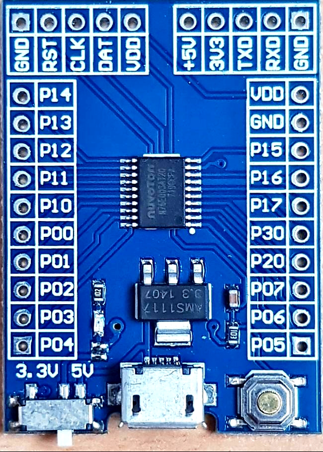

<!-- omit in toc -->
# Driving HPDL-1414 using MCP23017 I2C 16-Bit I/O Expander

- [Nuvoton N76E003 development board](#nuvoton-n76e003-development-board)
- [HPDL-1414 to MCP23017 wiring](#hpdl-1414-to-mcp23017-wiring)
- [Supported commands:](#supported-commands)
	- [i2c](#i2c)
	- [hpdl](#hpdl)
- [Used code and data](#used-code-and-data)

# Nuvoton N76E003 development board
There are a few different Nuvoton N76E003 development boards available online. This one was used for the test app:



```
               G R C D V    + 3 T R G
               N S L A D    5 V X X N
               D T K T D    V 3 0 0 D
               | | | | |    | | | | |
              +----------------------+
  I2C SDA  ---|11 P1.4         VDD  9|--- VDD
  I2C SCL  ---|12 P1.3         GND  7|--- GND
           ---|13 P1.2        P1.5 10|---
           ---|14 P1.1        P1.6 8 |--- DAT [ICP]
      MARK ---|15 P1.0        P1.7 7 |---
           ---|16 P0.0        P3.0 5 |---
           ---|17 P0.1        P2.0 2 |--- RST [ICP]
 [ICP] CLK ---|18 P0.2        P0.7 3 |--- UART0 RX
           ---|19 P0.3        P0.6 2 |--- UART0 TX
           ---|20 P0.4        P0.5 1 |---
              +----------------------+
```

# HPDL-1414 to MCP23017 wiring

| HPDL | MPC |
| ---- | --- |
| D0   | PA0 |
| D1   | PA1 |
| D2   | PA2 |
| D3   | PA3 |
| D4   | PA4 |
| D5   | PA5 |
| D6   | PA6 |
| A0   | PB0 |
| A1   | PB1 |
| WR   | PB2 |


# Supported commands:
```
> help
VER: 2105.01 (4451 bytes)
CMD:
    reset
    i2c scan
    i2c speed 100|400|800|1000
    i2c wr $dev $val [$val ...]
    i2c read $dev $addr [$len]
    hpdl @ACCCC
    hpdl $addr $char
    hpdl test on|off
```
## i2c
hpdl-1414 example initializes I2C clock to 1MHz, to change it use ``i2c speed`` command, for example, to set clock speed to 400kHz:

```
> i2c speed 400
```
To restore 1MHz:
```
> i2c speed 1000
```

To scan I2C bus for connected devices use ``i2c scan`` command:
```
> i2c scan
Found device: 0x20 (0x40)
```
0x20 address: MCP23017 I2C 16-Bit I/O Expander

To read data from I2C device (with re-start condition) use ``i2c read $dev $addr [$len]`` command. For example, to read MCP23017 I2C 16-Bit I/O Expander IODIRA and IODIRB registers in sequential 16 bit mode after reset:
```
> i2c read x20 0 2
 xFF xFF
```

To write data to I2C device use ``i2c wr`` command. For example, to initialize [MCP23017]( https://www.microchip.com/wwwproducts/en/MCP23017) and set all pins as output:

```
> i2c wr x20 0 0 0
```
## hpdl
Note: left-to-right addressing is used in this example, so the leftmost position is 0 and the rightmost is 3.

``hpdl @ACCCC`` will display charater(s) C starting from address A. Fr example, ``hpdl @01234`` will display ``1234``, ``hpdl @3.`` will set right-most character to ``.``, so ``123.`` will be displayed.

``hpdl $addr $char`` displays the given character at the given address. For example, ``hpdl 2 F`` will display ``F`` at address 2.

``hpdl test on|off`` toggles test mode ON and OFF. When test mode is ON, display will cycle between ``OOOO``, ``****`` and ``....`` strings testing all LED segments.

# Used code and data
```
   Name              Start    End  Size   Max Spare
   ---------------- ------ ------ ----- ----- -----------
   REG BANKS        0x0000 0x000F     2     4     2
   IDATA            0x0000 0x0054    85   256   171
   OVERLAYS                           2
   STACK            0x0055 0x00FF   171   248   171
   EXTERNAL RAM     0x0001 0x00c8   200   768   568 74.0% free
   ROM/EPROM/FLASH  0x0000 0x1162  4451 18432 13981 75.9% free
```

