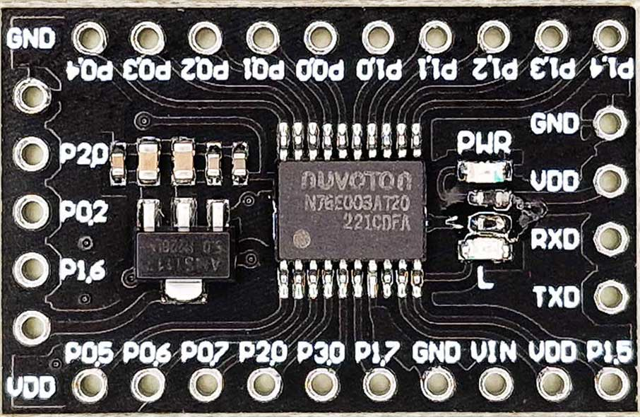
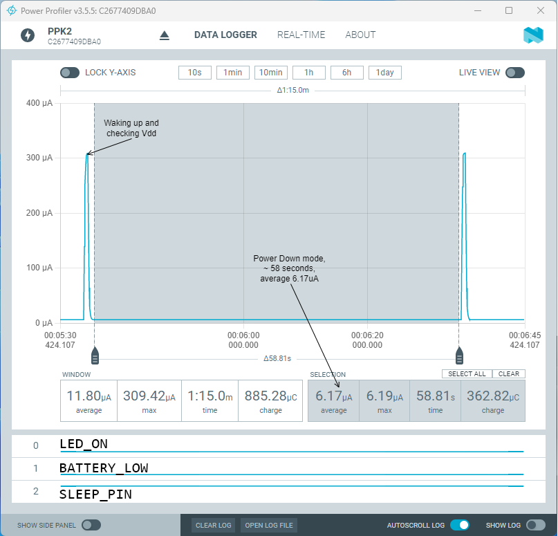
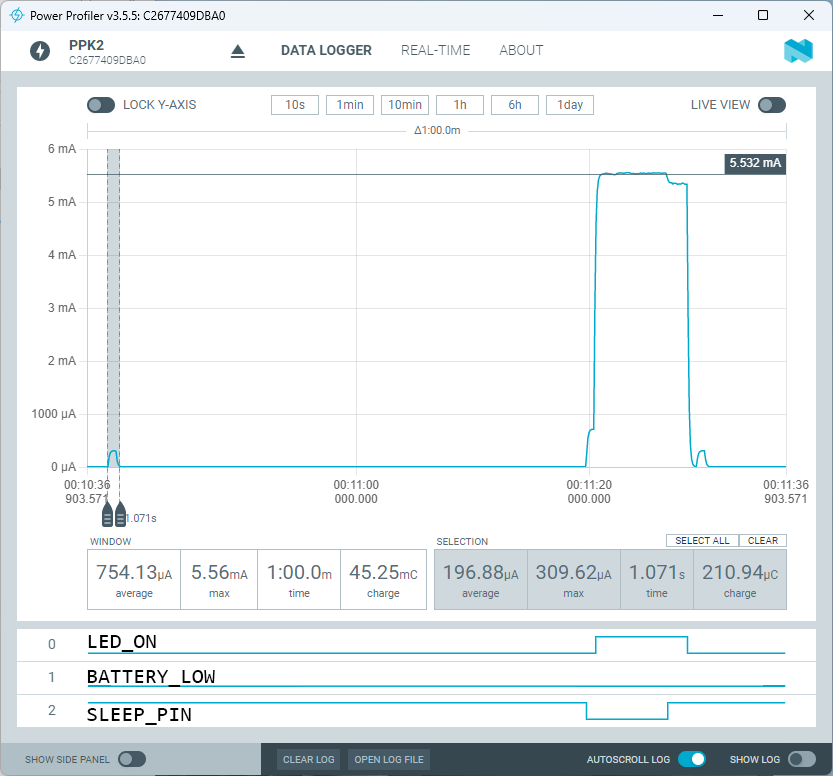

<!-- omit in toc -->
# Switch Nuvoton N76E003 to power down mode on timer

- [Nuvoton N76E003 development board](#nuvoton-n76e003-development-board)
- [Supported commands:](#supported-commands)
	- [reset](#reset)
	- [vdd](#vdd)
	- [pwr](#pwr)
- [Used code and data](#used-code-and-data)
- [State machine](#state-machine)
- [Power states](#power-states)

# Nuvoton N76E003 development board
In this example PWM is used to drive LED depending on Li-ion battery voltage.

When battery is low, or if LEN timer is OFF, Nuvoton switches to power-down mode.

Small version of Nuvoton N76E003 development board used:



```
                        G V R T
                        N D X X
                        D D 0 0
                        | | | |
                +---------------------+
 STATE.OUT.1 ---|11 P1.4       P1.5 11|--- (BLINK)
 STATE.OUT.0 ---|12 P1.3        VDD 10|--- VDD
        PWM0 ---|13 P1.2        VIN 9 |--- VDD (VIN)
         CLO ---|14 P1.1        GND 8 |--- GND
             ---|15 P1.0       P1.7 7 |---
             ---|16 P0.0       P3.0 5 |--- SLEEP_TIMER
   SLEEP.OUT ---|17 P0.1       P2.0 2 |--- RST [ICP]
   [ICP] CLK ---|18 P0.2       P0.7 3 |--- UART0 RX
             ---|19 P0.3       P0.6 2 |--- UART0 TX
        MARK ---|20 P0.4       P0.5 1 |---
                +---------------------+
                       | | | | |
                       G R C D V
                       N S L A D
                       D T K T D
```
Board was modified to save power - AMS1117 voltage regulator remoed and Power led disconnected.

"Sleep Timer" - unnamed board from LED with 6 hours on and 18 hours off cycle. LED on this board was replaced with 10K resistor.


``MARK`` and ``CLO`` used as test points with oscilloscope.
``SLEEP.OUT``, ``STATE.OUT.0`` and ``STATE.OUT.1`` used as test points with Nordic Power Profiler Kit II.

Note that UART is active only in STATE_LED_ON state.

# Supported commands:
```
> help
VER: 2311.18 (6647 bytes)
BGP: 0672 1237 mV
Vdd: 3604 mV
CMD:
    vdd [$val]
	pwr [auto|$pwr]
    reset
```
## reset
Trigger soft reset

## vdd
Measure and print current Vdd or calculate PWM duty for the given Vdd.
```
> vdd
Vdd: 3604 mV, PWM: 85% STATE_LED_ON
> vdd 360
Vdd: 3.60 V, PWM: 85%
```
Note that vdd command used Vdd argument in 300 to 420 range (instead of 3000 to 4200 mV range).

## pwr
Sets LED power in % by controlling PWM duty.
```
> pwr
Auto: 70 %
> pwr 10
> pwr
Manual: 10 %
```

# Used code and data
```
   Name              Start    End  Size   Max Spare
   ---------------- ------ ------ ----- ----- -----------
   REG BANKS        0x0000 0x000F     2     4     2
   IDATA            0x0000 0x005F    96   256   160
   OVERLAYS                           2
   STACK            0x0060 0x00FF   160   248   160
   EXTERNAL RAM     0x0001 0x00c7   199   768   569 74.1% free
   ROM/EPROM/FLASH  0x0000 0x19f6  6647 18432 11785 63.9% free
```

# State machine


Three states:

**STATE_LED_ON**

SLEEP_TIMER_PIN = 0, Vdd >= 3.0V.

Fsys 16MHz, WKT timer fires every 1 msec.

PWM0 is used to drive LED according to lithium-ion battery voltage.

``LED_POWER_USE_MAP`` in main.h controls how PWM duty is calculated.

``#define LED_POWER_USE_MAP 0`` changes PWM duty between 70% (Vdd 4.2V) and 100% (Vdd 3.0V). This mode works best with BJT transistors.

``#define LED_POWER_USE_MAP 1`` calculates PWN duty according to map measured for average current through the LED Bulb. For example:

| Vdd  | PWM | mA | PWM | mA |
|------|----:|----|----:|--- |
| 3.00 | 100 | 20 | 100 | 20 |
| 3.20 | 100 | 30 | 100 | 30 |
| 3.40 |  65 | 30 |  80 | 40 |
| 3.60 |  50 | 30 |  61 | 40 |
| 3.80 |  43 | 30 |  54 | 40 |
| 4.00 |  38 | 30 |  48 | 40 |
| 4.20 |  35 | 30 |  44 | 40 |

This mode works best with BS170 MOSFET as it changes Rds dymanically depending on Vdd and Vgs. For single Li-ion battery voltages between 3.0V and 4.2V BS170 can be used without any LED current limiting resistors as Rds of BS170 is high enough.

**STATE_LED_OFF**

SLEEP_TIMER_PIN = 1, Vdd >= 3.0V.

Fsys 10MHz, WKT timer fires every 1 minute to check Vdd.

**STATE_LED_OFF**

SLEEP_TIMER_PIN = ?, Vdd < 3.0V.

Fsys 10MHz, WKT timer fires every 1 minute to check Vdd.

# Power states
Some tricks to save power in power-down mode:
* Disable BOD ``clr_BODEN; /* disable BOD circuit to save power in power down mode */``
* Disable IAP ``iap_disable();`` if you have it enabled
* Switch to 10KHz low speed oscillator ``fsys_set_clock(FSYS_10KHZ);``
* Set maximal WKT timer interval ``wkt_tick_set_mode(WKT_TICK_MINUTE);``

Combining all the above will help to achieve ~6 uA:



with ~300uA every minute to check Vdd

With LED and timer not attached in Power ON mode this board will consume ~ 6mA:



Current measurements are for the bare board, no LED or timer are attached.

