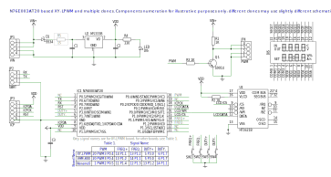

# XY-LPWM Alternative Firmware

Alternative firmware for popular single channel PWM generator XY-LPWM and its clones.

There are at least three different versions of XY-LPWM:
* XY-LPWM
* VHM-800
* Un-named board

but schematics is very similar for all of them:


Select your board type in the ``target.h`` file:
```C
#define XY_LPWM_BOARD 1
#define VHM_800_BOARD 2
#define NONAME_BOARD  3

/** assign TARGET_BOARD to one of the *_BOARD above to set the target board type */
#define TARGET_BOARD VHM_800_BOARD
```
Also you can swap inrement/decrement keys:
```C
/*
 * Originally XY-LPWM board has increment keys on the left and decrement on the right:
 * +-------+-------+-------+-------+
 * | FREQ+ | FREQ- | DUTY+ | DUTY- |
 * +-------+-------+-------+-------+
 *
 * set SWAP_KEYS to 1 to swap increment/decrement keys:
 * +-------+-------+-------+-------+
 * | FREQ- | FREQ+ | DUTY- | DUTY+ |
 * +-------+-------+-------+-------+
 */
#define SWAP_KEYS 1
```

## What is new compare to the original firmware:
* Frequency range increased to 160kHz
* Duty accuracy improved
* Double acceleration mode added for keys handling, so frequency/duty values can be changed faster
* Extended set of commands over serial port interface (baudrate 38400)

## Supported commands:
* *reset* do soft reset
* *pwm* show current PWM configuration
* *duty 0-100* set PWM duty cycle
* *freq k001-160k* set PWM frequency
* *out on|off|negative|direct* control PWM output

## pmw command
``on freq: 1k00, duty: 50 negative`` - PWM is ON, 1.00kHz, 50%, negative polarity

## duty 0-100 command
``duty 25`` - set PWM duty cycle to 25%

## freq k001-160k command
``freq k001`` - set PWM frequency cycle to 1 Hz
``freq 1k50`` - set PWM frequency cycle to 1.5 kHz
``freq 160k`` - set PWM frequency cycle to 160 kHz

## out on|off|negative|direct command
``out on|off`` - turn PWM signal output ON or OFF
``out negative|direct`` - set PWM signal output to negative or direct
