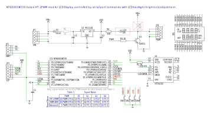
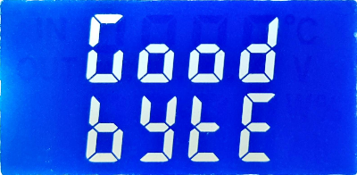
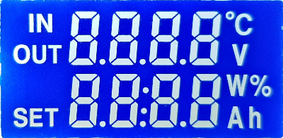
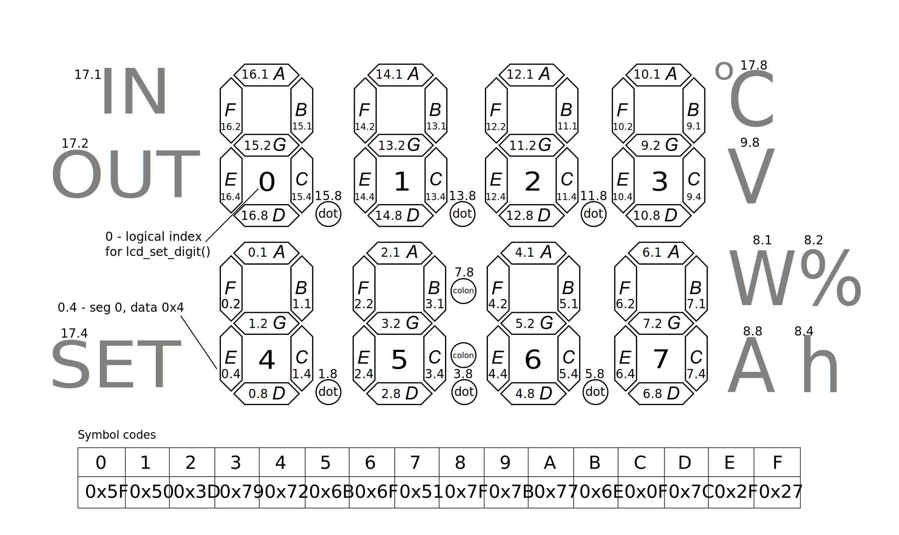

# XY-LPWM-LCD - LCD display controlled by serial port commands

Demonstrates how popular single channel PWM generator XY-LPWM and its clones can be used as LCD Display.

There are at least three different versions of XY-LPWM:
* XY-LPWM
* VHM-800
* Un-named board with a bit different LCD layout

but schematics is very similar for all of them and can be easily changed to use PWM channel to control LCD backlight:


## In this example:

Key ``SW1`` (original FREQ+) is used to turn LCD display on and off.

Key ``SW2`` is not used.

Keys ``SW3`` and ``SW4`` (original DUTY+ and DUTY-) used to control backlight.

Pressing both ``SW1`` and ``SW4`` simultaneously will case soft reset.

On startup N76E003 will measure Vdd, display voltage on the screes for a couple of seconds and then will clean LCD and wait for commands on the serial port.

Serial connection speed should be set to 38400 baud.

## Used code and data memory
```
   Name              Start    End  Size   Max Spare
   ---------------- ------ ------ ----- ----- -----------
   REG BANKS        0x0000 0x000F     2     4     2
   IDATA            0x0000 0x0075   118   256   138
   OVERLAYS                           3
   STACK            0x0076 0x00FF   138   248   138
   EXTERNAL RAM     0x0001 0x00db   219   768   549 71.5% free
   ROM/EPROM/FLASH  0x0000 0x229b  8860 18432  9572 51.9% free
```

## Supported commands:
* *reset* do soft reset
* *lcd 0#...7#* display specified symbol at the given position, up to 8 symbols can be provided
* *lcd @0-7#...#* display provided string of up to 8 symbols starting at the given position
* *lcd raw 0-7 xXX* write raw hexadecimal value to LCD off-screen buffer
* *lcd map 0-17 xX* write raw value directly to HT1621 segment map memory
* *lcd sig S#...S#* control appearance of the given signs
* *lcd led [1-100]* set LCD backlight level or prints current state
* *lcd on|off* turn HT1621 and backlight on or off
* *lcd clear/fill* set all segments to 0 or 1
* *lcd dump* dump LCD off-screen memory

## lcd 0#...#7 command
This command addresses digits individually and accepts up to 8 symbols in the 'IS' format, where 'I' is the digit Index and 'S' the symbol to display.

For example, ``lcd 0A2B3C4D`` will display ``ABCd``, ``lcd 0A1 2 3A`` will display ``A  A``

## lcd @0-7#...#
This command addresses digits sequentially and accepts up to 8 symbols with dots starting from the given digit index.

For example:
* ``lcd @0Food`` will display ``Food`` in the first line
* ``lcd @11.234567.0`` will display ``01.23`` in the first line and ``45:67`` in the second line

``lcd @GoodByte`` will display:



*Note* that '.' for position 3 will display 'V' sign and '.' for position 7 will display colon sign for the line 2.

## lcd raw 0-8 xXX
This command writes raw value to lcd buffer for the given digit index,
``lcd raw I xXX`` where 'I' is the digit Index and 'xXX' hexadecimal value to write.

For example, ``lcd raw 2 x80`` will display the dot for digit at position 2.

See lcd_lpwm.h for off-screen buffer structure.

## lcd map 0-17 xX
This command writes four bits directly to HT1621 segments map in the
``lcd map I xX`` format where 'I' is the segment map Index and 'xX' hexadecimal value to write.

For example, ``lcd map 16 xF`` will display ``C`` for digit position 0.

See lcd_lpwm.h for HT1621 segments map structure.

## lcd sig S#...S#
This command can display up to 8 signs in the 'IS' format, where 'I' is the sign Index and 'S' value to set: ' ' will turn sign off, anything else to turn it on.

For example, ``I.O.S.C.V.W.%.A.h.`` will display all side signs, ``0.1.2.4.5.6.`` will display all dots. Sequence of two commands, ``:.`` as the first command with the following ``: `` will pulse the colon sign.

## lcd clear|fill
``lcd clear`` turns off all segments, ``lcd fill`` turns all segments on:



The figure below depicts LCD display format and how LCD off-screen buffer addresses display segments.

